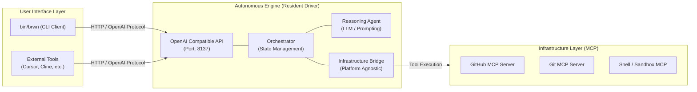

# Brownie アーキテクチャ構成 (v2.0)

## 1. Resident Driver 接続モデル

Brownie は、特定のプラットフォームに縛られない「自律型推論エンジン」として、**常駐型エンジン (Engine)** と **アタッチ型クライアント (CLI)** の分離構造を採用しています。

## 2. 主要コンポーネントの役割

### **Autonomous Engine (Backend)**
*   **OpenAI Compatible API**: FastAPI をベースとした通信層。`localhost:8137` にて `/v1/chat/completions` エンドポイントを提供し、標準的な LLM クライアントからの接続を受け付けます。
*   **Orchestrator**: 推論エンジンの中心。「脳」として、現在の作業コンテキスト、タスクの進捗、履歴を管理します。
*   **Infrastructure Bridge**: 実世界（GitHub, Git, ファイルシステム）とのインターフェース。すべてのツール呼び出し（MCP）を抽象化し、エンジンが「GitHub 専用ではない」状態を保ちます。

### **CLI Client (Frontend)**
*   **bin/brwn**: ユーザーとの接点。実行時にバックグラウンドでエンジンが動いているかを確認し、未起動の場合は自動起動させた上で、対話セッションを確立します。
*   **Resident Connection**: CLI を終了してもエンジンはメモリ上で常駐し続け、次回の `bin/brwn` 実行時にコンテキストを引き継いだまま即座に復帰します。

## 3. 通信仕様
*   **Port**: `8137` (Docker や標準的な Web 開発ポートとの競合を避けるため)
*   **Protocol**: OpenAI API 互換プロトコル
*   **Authentication**: `.env` 内の `GITHUB_TOKEN` 等をインフラ層（MCP）が利用。

## 4. 拡張性
このアーキテクチャにより、エンジンのロジックを一切変えずに、Slack, VS Code 拡張機能, ブラウザUI 等、あらゆるフロントエンドからの利用が可能になっています。
