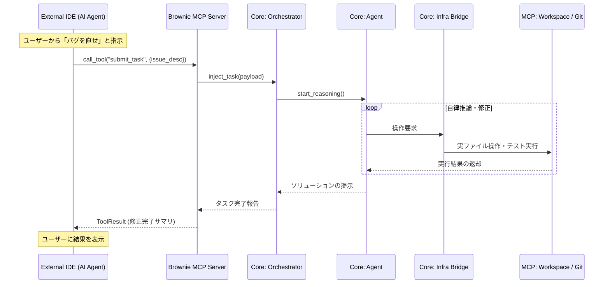
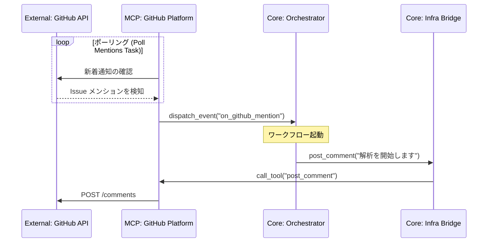
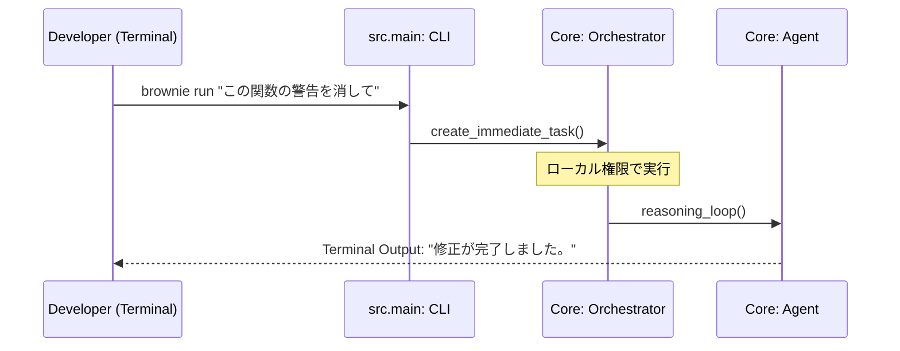

# Brownie Architecture V2: Multi-Platform Input Interaction

BROWNIE は、あらゆる入力ソース（GitHub, IDE, CLI）から同一の推論品質を提供するプラットフォーム非依存の設計を採用しています。以下に、主要な入力ルートごとのシーケンスを詳述します。

---

## 1. IDE 連携フロー (IDE -> Brownie MCP Server)

Brownie 自身が MCP サーバーとして振る舞い、外部の IDE AI エージェント（Cline, Roo Code 等）に思考能力を提供する最も強力な連携モードです。

---

## 2. GitHub 連携フロー (GitHub -> Webhook/Polling)

GitHub 上の Issue や PR コメントをトリガーに、非同期で自律修正を行う、開発自動化の中核フローです。

---

## 3. CLI 直接操作フロー (CLI -> Local Entrypoint)

開発者がローカル環境で直接コマンドを叩き、Brownie をスタンドアロンのツールとして使用する高速開発フローです。

---

## 4. 全プラットフォーム共通の接続構造

すべての入力ソースは、最終的に `Orchestrator` へとタスクを投入し、同一の `Agent` と `Infra Bridge` を共有します。

| 入力ソース | Brownie の役割 | トリガー | 成果物の届け先 |
| :--- | :--- | :--- | :--- |
| **GitHub** | 自律保守エージェント | コメント / メンション | GitHub Comment / PR |
| **IDE (VS Code等)** | 思考 MCP プロバイダー | IDE 経由のツール呼び出し | IDE エディタ上の反映 |
| **CLI** | スタンドアロン・アシスタント | コマンド実行 | 標準出力 / ローカルファイル |
| **Slack / Email** | プロンプト・インターフェース | メッセージ受信 | 返信メッセージ |

---

このマルチ・インターフェース設計により、Brownie はコンテキスト（どこで呼ばれたか）に縛られず、常に一貫した開発能力を提供します。
