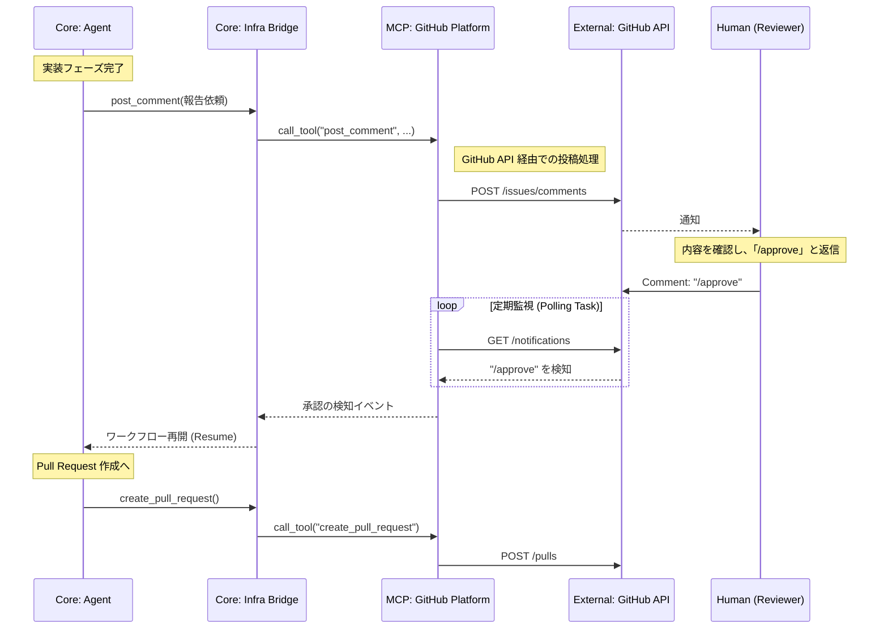
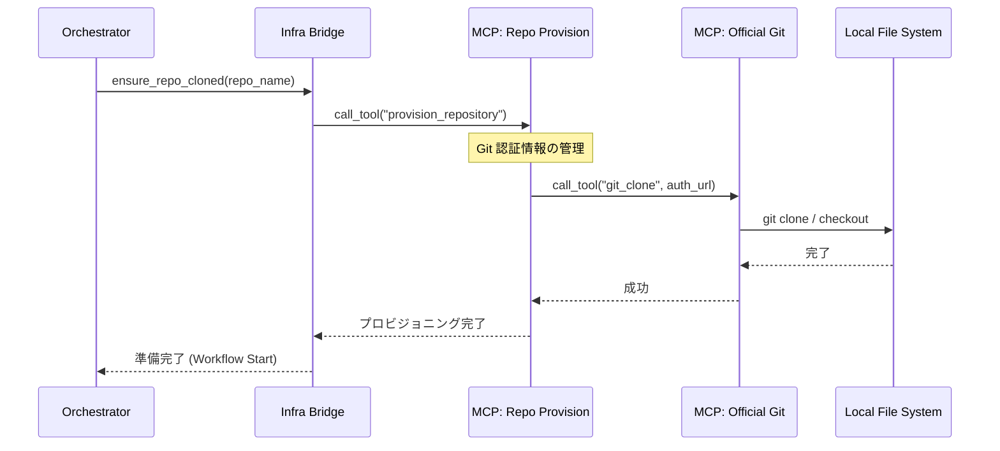

# Brownie Architecture V2: Detailed Interaction Model

BROWNIE は、プラットフォーム固有のロジック（GitHub 等）を実行層 (MCP) へ完全に分離したことで、コア知能の汎用化と安全性を高めました。以下に、刷新された対話フローの詳細を記述します。

---

## 1. 刷新された HITL (Human-In-The-Loop) フロー

以前の構成とは異なり、GitHub へのアクセスはすべて **Execution Plane (MCP Layer)** を介して行われます。

---

## 2. リポジトリ・プロビジョニング・フロー

リポジトリのクローンや同期も、コアが直接 git コマンドを叩くのではなく、MCP 経由で抽象化された要求として処理されます。

---

## 3. コンポーネント間コントラクト

以前の `Home.md` で定義された 3-Plane 構造を維持しつつ、接続インターフェースを MCP に一本化しました。

| コンポーネント | 以前の状態 (V1) | 現在の状態 (V2) |
| :--- | :--- | :--- |
| **Orchestrator** | GitHub API を直接操作 | **純粋な状態管理のみ** (Bridge 経由) |
| **Agent** | GitHub ラッパーに依存 | **プラットフォーム非依存** (Bridge 経由) |
| **GitHub Logic** | `src/gh_platform_client.py` | **`GitHub Platform MCP`** (分離) |
| **通信プロトコル** | Direct Python Call | **MCP (stdio/JSON-RPC)** |

---

この構造により、コアは「誰と喋っているか」を意識せず、`Infrastructure Bridge` という一貫した神経節を通じて、外の世界（GitHub, Git, Sandbox 等）を操ることが可能になっています。
