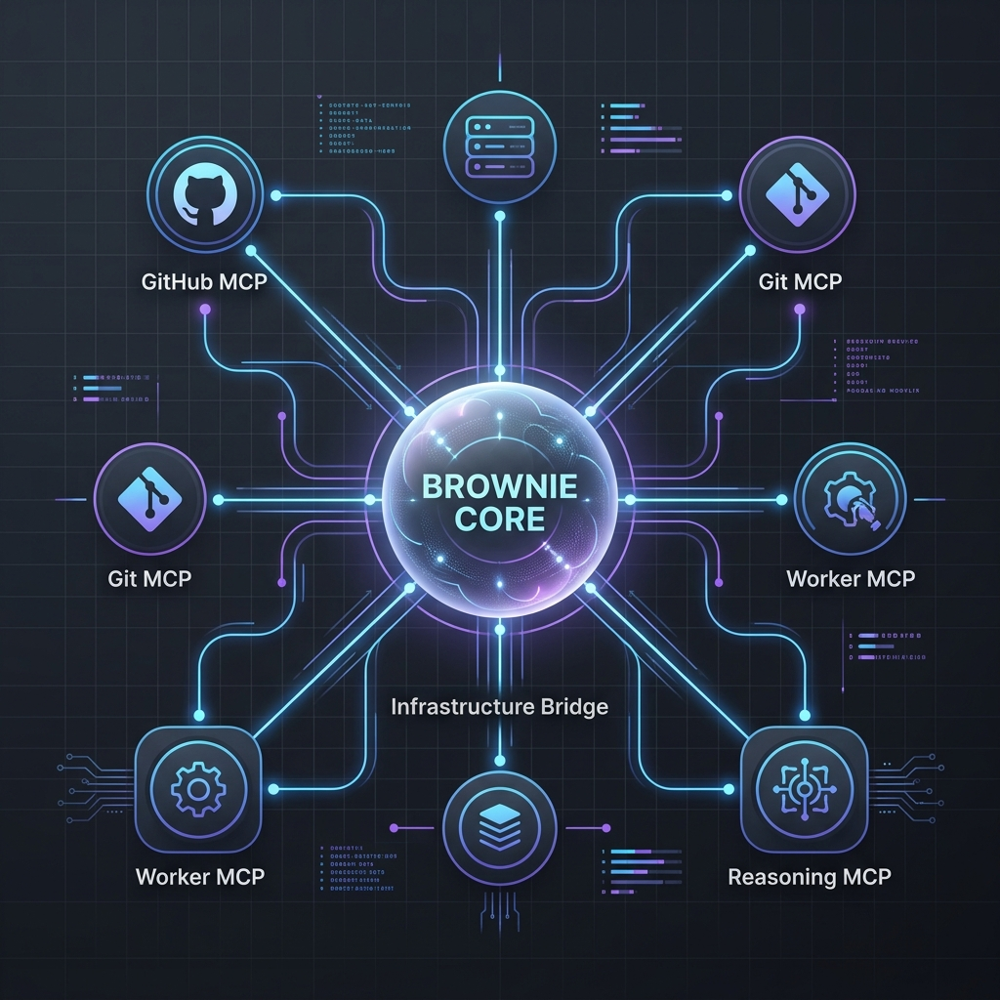

# Brownie Architecture V2: The Decoupled Reasoning Engine

## 1. Visual Overview
Brownie V2 は、コアとなる推論エンジンを外部プラットフォーム（GitHub 等）から完全に分離し、すべてのインフラ操作を **MCP (Model Context Protocol)** という「神経系」を介して実行する、主権型アーキテクチャを採用しています。

## 2. アーキテクチャの核心

### **Brownie Core (中央集権的推論)**
システムの「脳」に当たります。特定のプラットフォームの API 仕様（GitHub 等）に汚染されることなく、純粋な思考とタスクのオーケストレーションに専念します。
- **Orchestrator**: プロジェクトのライフサイクルと状態遷移を論理的に管理。
- **Infrastructure Bridge**: Core からの「抽象的な要求」を、具体的な MCP ツール呼び出しへと変換するインターフェース。

### **MCP Layer (分散型インフラ)**
GitHub, Git 操作, 推論ループなどの「実務」を担う、独立したサーバー群です。
- **GitHub Platform MCP**: GitHub との API 通信と通知の取得をカプセル化。
- **Git MCP**: ローカルファイルシステム上の Git 操作を安全に実行。
- **Reasoning MCP**: 高度な推論ループを独立して回す実行体。

## 3. この設計がもたらす革新
- **圧倒的な拡張性**: 新しいプラットフォーム（Slack, GitLab, Backlog 等）を追加する際も、コアを一切弄らずに MCP を差し替えるだけで対応可能。
- **純粋な知能の再利用**: 同じ思考回路（Core）を、CLI, GitHub, Web UI など、あらゆるインターフェースで共通して利用可能。
- **堅牢なセキュリティ**: 実務層（MCP）と思考層（Core）が分離されているため、各レイヤーで厳格な権限管理が可能。
