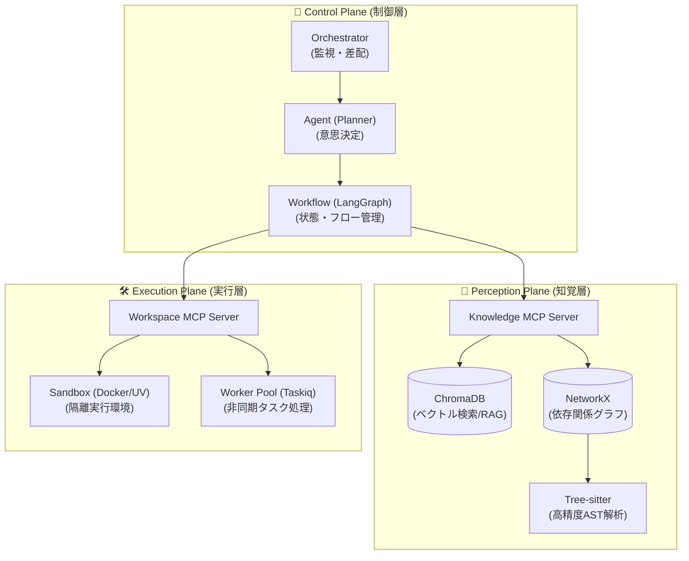
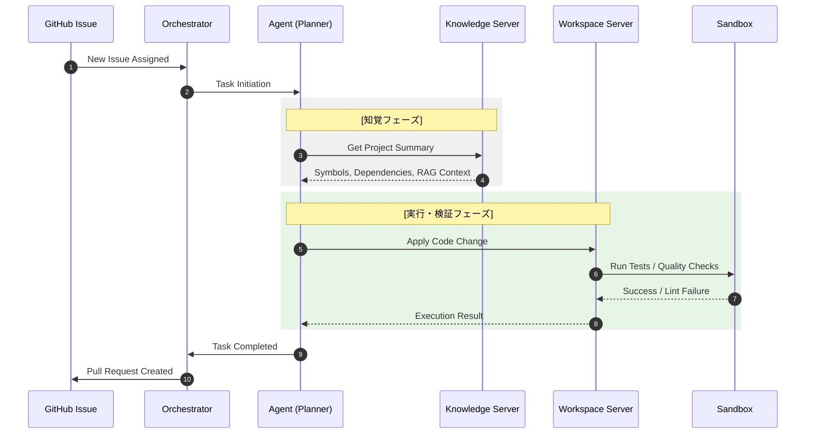

# Brownie システムアーキテクチャ設計書 (v2.0)

BROWNIE は、推論（Control）、知覚（Perception）、実行（Execution）を完全に分離し、Model Context Protocol (MCP) を基盤とした疎結合で堅牢な自律型 AI 開発アーキテクチャを採用しています。

---

## 1. システム全体俯瞰図 (3-Plane Architecture)

BROWNIE の責務は物理的・プロトコルレベルで以下の3層に分離されています。

---

## 2. 主要構成要素と責務

### 🧠 Control Plane (制御層)
*   **Orchestrator**: GitHub 等の外部イベントを監視し、タスクのライフサイクル全体（投入・監視・完了報告）を統括します。
*   **Agent (Planner)**: Pydantic AI を使用し、タスク目標、知覚データ、利用可能なツールを統合して「解決のための実行計画」を策定します。
*   **Workflow Manager**: LangGraph による状態遷移マシンを用いて、複雑な試行錯誤を伴う開発プロセスを永続化・チェックポイント管理します。

### 💾 Perception Plane (知覚層)
*   **Knowledge Base**: リポジトリ全体のソースコードを Tree-sitter で AST 解析し、WDCA (Wide-area Deep Context Awareness) 技術により広域な文脈情報をエージェントに提供します。
*   **Memory Integration**: 過去の修正事例や類似コードを ChromaDB からベクトル検索し、RAG (Retrieval-Augmented Generation) によって推論精度を高めます。

### 🛠 Execution Plane (実行層)
*   **Workspace Management**: ファイル操作、Lint (Ruff)、セキュリティスキャン (Bandit/Semgrep) などの実作業を担います。
*   **Safe Execution**: 破壊的なコマンドやテストの実行は、完全に隔離された Sandbox 環境で行い、ホストシステムへの影響を遮断します。

---

## 3. タスク実行フロー (End-to-End Sequence)

---

## 4. ディレクトリ構造の対応

| 物理パス | 論理レイヤー | 主要クラス/役割 |
| :--- | :--- | :--- |
| `src/core/orchestrator.py` | Control | タスクキューとフローの制御 |
| `src/core/agent.py` | Control | プランニング・意思決定 |
| `src/core/knowledge_base.py` | Perception | AST解析・グラフ構築 |
| `src/mcp_server/workspace.py` | Execution | ファイル・ツール操作の提供 |
| `src/utils/cmd_helper.py` | Execution | セキュアなコマンド実行 |
| `config/config.yaml` | Base | システム全体のパラメーター設定 |

---
> 📅 **作成日**: 2026-04-20
> 📝 **ステータス**: 最新の物理修正（例外処置・セキュリティ強化）を反映済み
